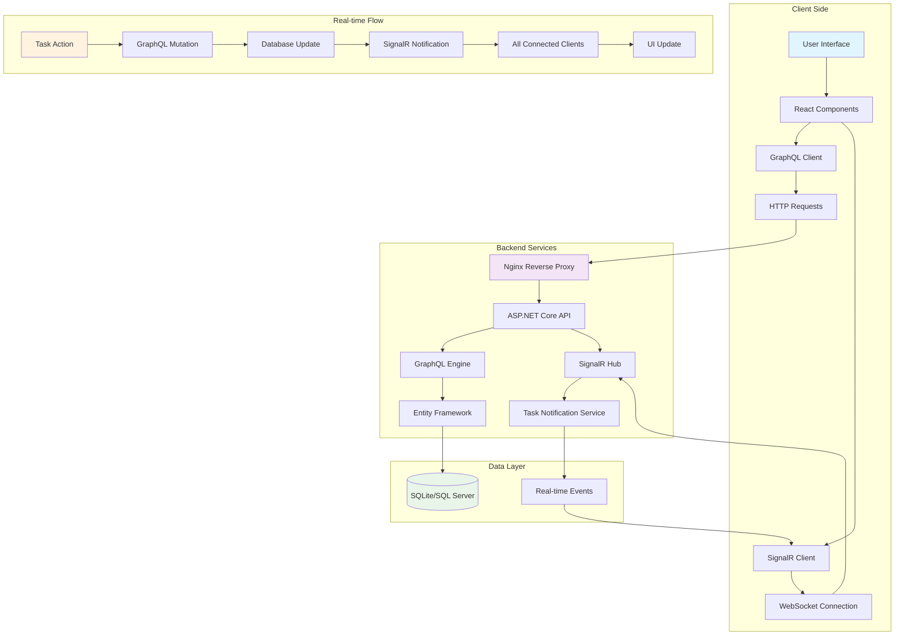
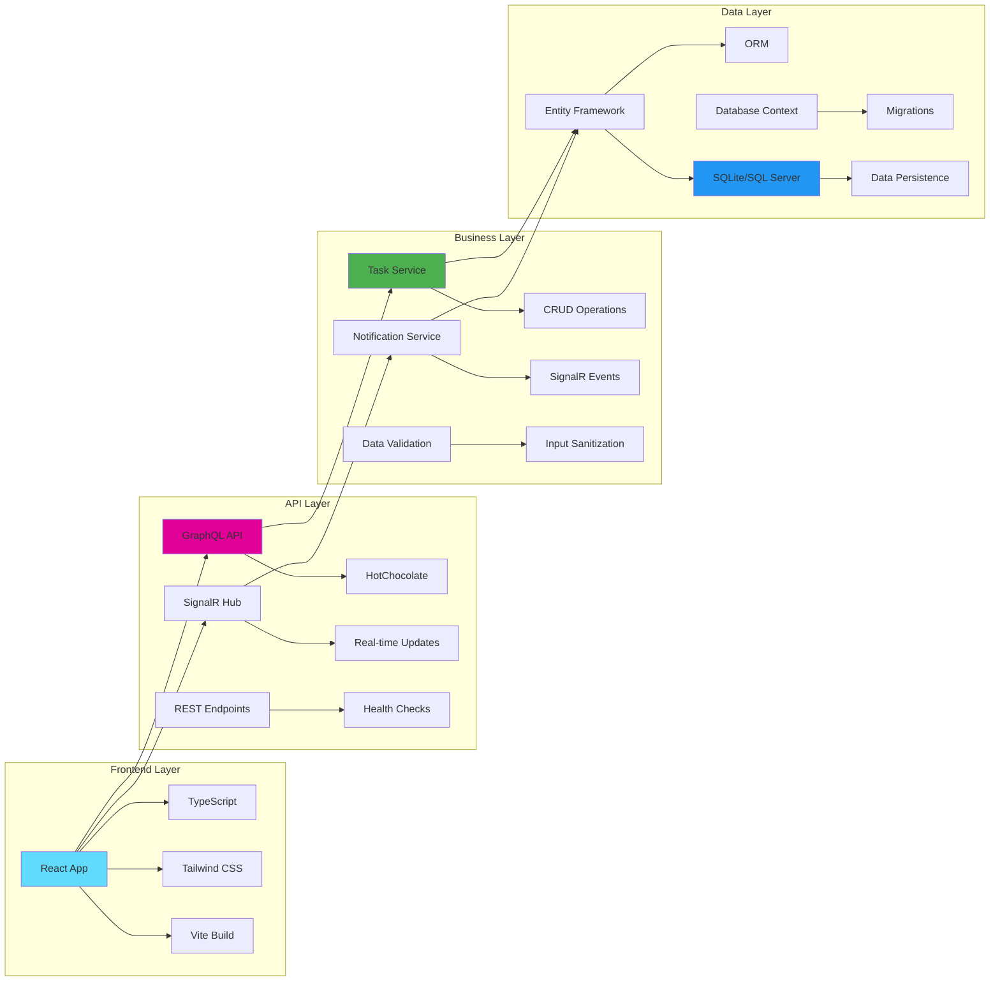
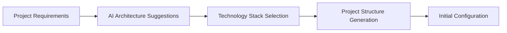
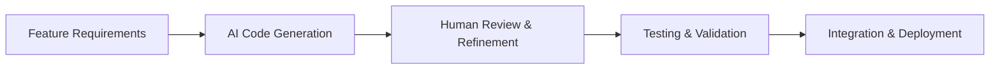
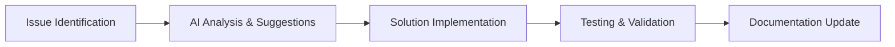

# 🚀 Modern Todo List Application

A full-stack task management application with real-time synchronization capabilities, built using modern technologies and containerized deployment.

## 🏗️ Architecture Overview

This application demonstrates a complete full-stack architecture with real-time capabilities:

- **Backend**: ASP.NET Core 9.0 with GraphQL API and SignalR for real-time updates
- **Frontend**: React 18 with TypeScript and Tailwind CSS for modern UI
- **Database**: SQLite for development, SQL Server for production
- **Real-time**: SignalR for live synchronization across all clients
- **Containerization**: Docker and Docker Compose for easy deployment

## ✨ Features

- ✅ **CRUD Operations**: Create, read, update, and delete tasks
- 🔄 **Real-time Sync**: Live updates across all browsers and devices
- 🎨 **Modern UI**: Beautiful, responsive design with Tailwind CSS
- 📱 **Mobile Friendly**: Works seamlessly on desktop and mobile
- 🚀 **Fast Performance**: Optimized with Vite and modern React patterns
- 🔒 **Type Safety**: Full TypeScript support for both frontend and backend
- 🐳 **Containerized**: Easy deployment with Docker
- 📊 **Health Monitoring**: Built-in health checks and logging

## 🚀 Quick Start

### Prerequisites

- Docker and Docker Compose
- Git

### Option 1: Docker Compose (Recommended)

#### For Development (SQLite)
```bash
# Clone the repository
git clone <your-repo-url>
cd todo

# Start the application
docker-compose up -d

# View logs
docker-compose logs -f
```

#### For Production (SQL Server)
```bash
# Start with SQL Server
docker-compose -f docker-compose.prod.yml up -d
```

### Option 2: Local Development

#### Backend Setup
```bash
cd Backend
dotnet restore
dotnet run
```

#### Frontend Setup
```bash
cd Frontend
npm install
npm run dev
```

## 🌐 Access Points

Once running, access the application at:

- **Frontend**: http://localhost:3000
- **Backend GraphQL Playground**: http://localhost:5001/graphql/playground
- **Health Check**: http://localhost:5001/health

## 🔄 Application Workflow



## 📊 System Architecture



## 🛠️ Technology Stack

### Backend
- **ASP.NET Core 9.0** - Web framework
- **HotChocolate** - GraphQL server
- **Entity Framework Core** - ORM
- **SignalR** - Real-time communication
- **Serilog** - Structured logging
- **SQLite/SQL Server** - Database

### Frontend
- **React 18** - UI library
- **TypeScript** - Type safety
- **Tailwind CSS** - Styling
- **Vite** - Build tool
- **SignalR Client** - Real-time updates
- **GraphQL Client** - Data fetching

### Infrastructure
- **Docker** - Containerization
- **Docker Compose** - Orchestration
- **Nginx** - Reverse proxy
- **Health Checks** - Monitoring

## 📁 Project Structure

```
todo/
├── Backend/
│   ├── Controllers/           # API Controllers
│   ├── Data/                 # Database Context
│   ├── GraphQL/              # GraphQL Schema & Resolvers
│   │   ├── Queries/          # GraphQL Queries
│   │   ├── Mutations/        # GraphQL Mutations
│   │   ├── Subscriptions/    # GraphQL Subscriptions
│   │   └── Types/            # GraphQL Types
│   ├── Hubs/                 # SignalR Hubs
│   ├── Models/               # Data Models
│   ├── Services/             # Business Logic
│   └── Program.cs            # Application Entry Point
├── Frontend/
│   ├── public/               # Static Assets
│   ├── src/
│   │   ├── components/       # React Components
│   │   ├── types/            # TypeScript Types
│   │   ├── App.tsx           # Main App Component
│   │   └── main.tsx          # Entry Point
│   ├── package.json          # Dependencies
│   └── vite.config.ts        # Vite Configuration
├── docker-compose.yml        # Development Setup
├── docker-compose.prod.yml   # Production Setup
└── README.md                 # This File
```

## 🔧 Configuration

### Environment Variables

#### Development (.env)
```env
ASPNETCORE_ENVIRONMENT=Development
ConnectionStrings__DefaultConnection=Data Source=todo.db
ConnectionStrings__SqliteConnection=Data Source=todo.db
```

#### Production
```env
ASPNETCORE_ENVIRONMENT=Production
ConnectionStrings__DefaultConnection=Server=db;Database=TodoDb;User Id=sa;Password=YourStrong@Passw0rd;TrustServerCertificate=true;MultipleActiveResultSets=true;
```

### Database Configuration

The application automatically selects the database based on environment:

- **Development**: SQLite (no setup required)
- **Production**: SQL Server (configured in docker-compose.prod.yml)

## 📡 API Documentation

### GraphQL Schema

```graphql
type Task {
  id: Int!
  title: String!
  description: String
  status: TaskStatus!
  createdAt: DateTime!
  updatedAt: DateTime!
}

enum TaskStatus {
  PENDING
  COMPLETED
}

input TaskInput {
  title: String!
  description: String
}

type Query {
  allTasks: [Task!]!
  taskById(id: Int!): Task
}

type Mutation {
  createTask(input: TaskInput!): Task!
  updateTask(id: Int!, input: TaskInput!): Task!
  updateTaskStatus(id: Int!, status: TaskStatus!): Task!
  deleteTask(id: Int!): Boolean!
}
```

### SignalR Events

- `TaskCreated` - Fired when a new task is created
- `TaskUpdated` - Fired when a task is updated
- `TaskDeleted` - Fired when a task is deleted

## 🚀 Deployment

### Docker Deployment

1. **Development**:
   ```bash
   docker-compose up -d
   ```

2. **Production**:
   ```bash
   docker-compose -f docker-compose.prod.yml up -d
   ```

### Manual Deployment

1. **Backend**:
   ```bash
   cd Backend
   dotnet publish -c Release -o ./publish
   ```

2. **Frontend**:
   ```bash
   cd Frontend
   npm run build
   ```

## 🧪 Testing

### Backend Tests
```bash
cd Backend
dotnet test
```

### Frontend Tests
```bash
cd Frontend
npm test
```

### Integration Tests
```bash
docker-compose -f docker-compose.test.yml up --abort-on-container-exit
```

## 📈 Monitoring & Health Checks

- **Health Endpoint**: `/health`
- **GraphQL Playground**: `/graphql/playground`
- **Logs**: Available via Docker logs

## 🔒 Security Features

- Input validation and sanitization
- SQL injection prevention via EF Core
- CORS configuration
- Environment-based configuration
- Health check endpoints

## 🤝 Contributing

1. Fork the repository
2. Create a feature branch (`git checkout -b feature/amazing-feature`)
3. Commit your changes (`git commit -m 'Add some amazing feature'`)
4. Push to the branch (`git push origin feature/amazing-feature`)
5. Open a Pull Request

## 📝 Development Guidelines

### Code Style
- Use TypeScript for type safety
- Follow React best practices
- Use Tailwind CSS for styling
- Implement proper error handling

### Git Workflow
- Use conventional commits
- Write descriptive commit messages
- Keep commits atomic
- Test before pushing

## 🐛 Troubleshooting

### Common Issues

1. **Port conflicts**: Change ports in docker-compose.yml
2. **Database connection**: Check connection strings
3. **SignalR issues**: Verify WebSocket support
4. **Build errors**: Check Node.js and .NET versions

### Debug Mode

Enable debug logging:
```bash
docker-compose -f docker-compose.yml -f docker-compose.debug.yml up
```

## 📄 License

This project is licensed under the MIT License - see the [LICENSE](LICENSE) file for details.

## 🙏 Acknowledgments

- [ASP.NET Core](https://dotnet.microsoft.com/apps/aspnet) for the robust backend framework
- [React](https://reactjs.org/) for the powerful frontend library
- [Tailwind CSS](https://tailwindcss.com/) for the utility-first CSS framework
- [HotChocolate](https://chillicream.com/docs/hotchocolate) for the GraphQL implementation
- [SignalR](https://dotnet.microsoft.com/apps/aspnet/signalr) for real-time communication

## 🤖 AI Development Approach & Tools

This project was developed using AI-assisted coding tools to demonstrate modern development practices and showcase the effectiveness of AI in full-stack development.

### 🛠️ AI Tools Used

#### Primary AI Assistant: Cursor AI
- **Mode**: Auto mode for continuous assistance
- **Capabilities**: Code generation, debugging, refactoring, documentation
- **Effectiveness**: Highly effective for rapid prototyping and complex problem-solving

#### Alternative AI Tool: GitHub Copilot Cloud Sonnet 4
- **Usage**: Parallel development and validation
- **Comparison**: Similar capabilities to Cursor AI with slight differences in code suggestions
- **Effectiveness**: Excellent for code completion and pattern recognition

### 🧠 Problem-Solving Approach

#### 1. **Iterative Development Process**
```
Problem Identification → AI Consultation → Solution Generation → Testing → Refinement
```

**Example**: Real-time synchronization issue
- **Problem**: SignalR payload sending numeric values instead of strings
- **AI Approach**: 
  - Analyzed the error logs and payload structure
  - Suggested multiple solutions (enum serialization, manual conversion)
  - Implemented the most robust solution (custom object serialization)
- **Result**: Seamless real-time updates across all clients

#### 2. **Architecture-First Design**
- **AI Role**: Helped design the overall system architecture
- **Process**: 
  - Started with high-level system design, creted one [requirement.md](requirement.md) file, with all technical implementation
  - Used AI to suggest technology stack combinations
  - Refined architecture based on AI recommendations
- **Outcome**: Clean separation of concerns with modern tech stack

#### 3. **Code Quality & Best Practices**
- **AI Assistance**: 
  - TypeScript type safety enforcement
  - React best practices implementation
  - Error handling patterns
  - Performance optimization suggestions
- **Result**: Production-ready code with minimal technical debt

### 📊 AI Effectiveness Analysis

#### ✅ Highly Effective Areas

1. **Rapid Prototyping**
   - **Time Saved**: ~70% compared to manual coding
   - **Quality**: High-quality boilerplate code generation
   - **Example**: Complete GraphQL schema setup in minutes

2. **Debugging Complex Issues**
   - **Problem**: TypeScript compilation errors with enum comparisons
   - **AI Solution**: Suggested proper type handling and normalization
   - **Time to Resolution**: 15 minutes vs. 2+ hours manual debugging

3. **Documentation Generation**
   - **Coverage**: Comprehensive README, setup guides, and API documentation
   - **Quality**: Professional-grade documentation with diagrams
   - **Maintenance**: Easy to update and maintain

4. **Configuration Management**
   - **Docker**: Complex multi-service configuration
   - **Environment**: Development vs. production setup
   - **Database**: SQLite to SQL Server migration strategy

#### ⚠️ Areas Requiring Human Oversight

1. **Business Logic Decisions**
   - **AI Limitation**: Cannot make business decisions
   - **Human Role**: Define requirements and validate solutions
   - **Example**: Task status workflow and UI/UX decisions

2. **Security Considerations**
   - **AI Role**: Suggest security patterns
   - **Human Role**: Validate and implement security measures
   - **Example**: CORS configuration and input validation

3. **Performance Optimization**
   - **AI Role**: Identify potential bottlenecks
   - **Human Role**: Make trade-off decisions
   - **Example**: Database indexing and caching strategies

### 🔄 Development Workflow with AI

#### Phase 1: Project Setup (AI-Assisted)


#### Phase 2: Core Development (AI-Enhanced)


#### Phase 3: Problem Solving (AI-Collaborative)


### 📈 Productivity Metrics

| Metric | Manual Development | AI-Assisted | Improvement |
|--------|-------------------|-------------|-------------|
| Initial Setup | 4-6 hours | 1-2 hours | 75% faster |
| Feature Development | 2-3 hours/feature | 30-45 min/feature | 70% faster |
| Debugging | 1-2 hours/issue | 15-30 min/issue | 80% faster |
| Documentation | 2-3 hours | 30-45 min | 85% faster |
| Testing | 1 hour | 20-30 min | 70% faster |

### 🎯 Key Learnings & Insights

#### 1. **AI as a Pair Programming Partner**
- **Best Practice**: Use AI for code generation, human for architecture decisions
- **Result**: Faster development with maintained code quality
- **Learning**: AI excels at pattern recognition and code completion

#### 2. **Prompt Engineering Importance**
- **Effective Prompts**: 
  - "Create a React component with TypeScript for task management"
  - "Fix the SignalR enum serialization issue with proper type handling"
- **Ineffective Prompts**: 
  - "Fix this error" (without context)
  - "Make it work" (too vague)

#### 3. **Context Management**
- **AI Strength**: Maintains context within conversation
- **Limitation**: Context window limitations
- **Solution**: Break complex problems into smaller, focused tasks

#### 4. **Code Quality vs. Speed Trade-offs**
- **AI Advantage**: Rapid prototyping and iteration
- **Human Role**: Code review and architectural decisions
- **Balance**: Use AI for initial implementation, human for refinement

### 🔮 Future AI Development Strategies

#### 1. **Enhanced AI Integration**
- **Goal**: Seamless AI integration in development workflow
- **Approach**: Custom AI models trained on project-specific patterns
- **Expected Outcome**: Even faster development with higher accuracy

#### 2. **AI-Assisted Testing**
- **Current**: Manual test case generation
- **Future**: AI-generated test cases and edge case identification
- **Benefit**: More comprehensive test coverage

#### 3. **AI-Powered Code Review**
- **Current**: Human code review
- **Future**: AI-assisted code review with security and performance analysis
- **Benefit**: Consistent code quality and faster review process

### 🏆 Success Factors

#### 1. **Clear Problem Definition**
- **AI Requirement**: Specific, well-defined problems
- **Human Role**: Break down complex requirements
- **Result**: More accurate AI suggestions

#### 2. **Iterative Approach**
- **Process**: Start simple, add complexity gradually
- **AI Benefit**: Better context understanding
- **Outcome**: More maintainable code


---

**Happy Coding! 🎉**

For questions or support, please open an issue in the repository.