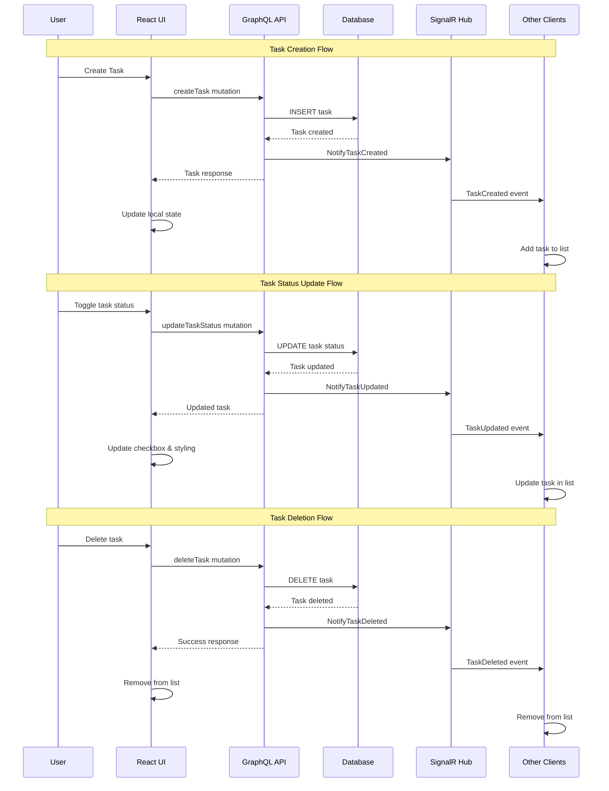
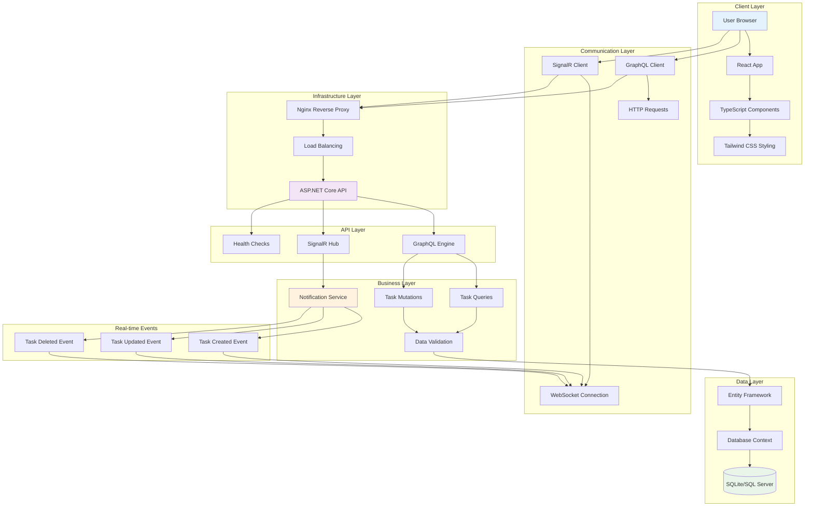
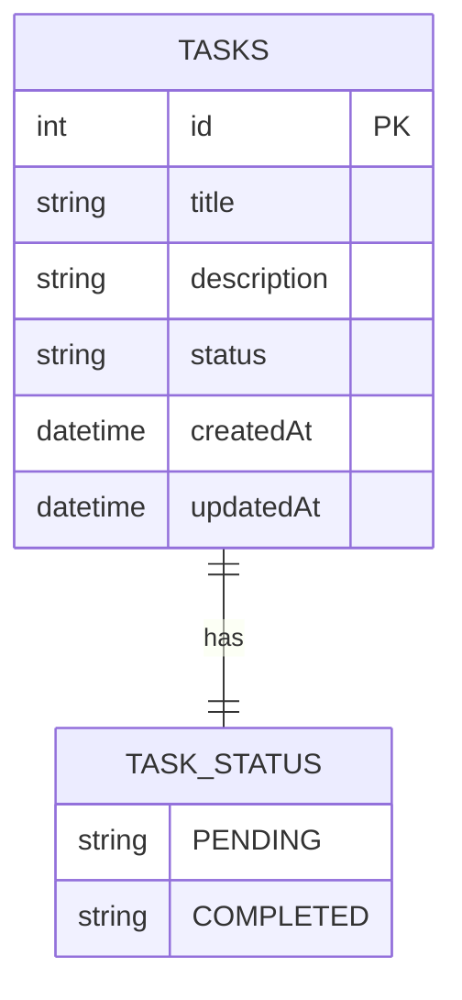
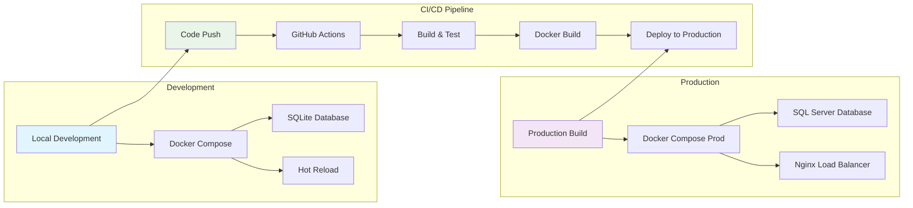
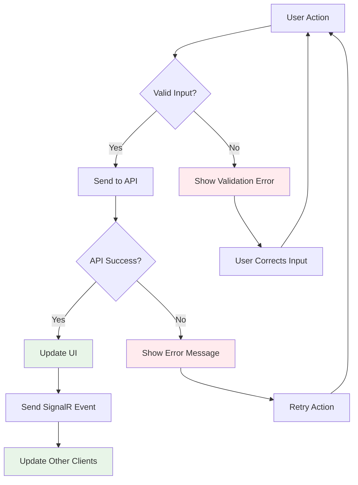
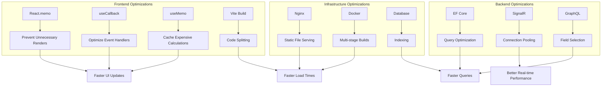

# 🔄 Application Workflow Diagrams

## Real-time Task Management Flow

## System Architecture Flow

## Database Schema Flow

## Deployment Flow

## Error Handling Flow

## Performance Optimization Flow

